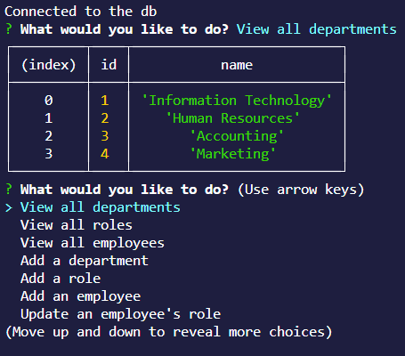

# tech-blog

## Table of Contents
- [Issues](#issues)
- [Description](#description)
- [Installation](#installation)
- [Usage](#usage)
- [Screenshot](#screenshot)
- [License](#license)

## Issues
The main issue I encountered while doing this was improperly timed calls to a new Inquirer object would result in the DB data that gets returned to overlay in the terminal and bug out the application. Using async is what fixes this issue, however I still found it interesting how the two interacted, overlapping the same spot in the terminal.

## Description
Creating a functioning HR database users can interact with using Inquirer and MySQL2. This would likely be unpleasent to use versus a modern day HR solution, however it's still pretty fun to code as an HR database does a good job of leveraging what makes relational databases cool, without becoming too overly complicated.

## Installation
Installations required:  
npm i

## Usage
Run this from the command line with "npm start"

## Link
This app is CLI based, and does not have a live deployment.

## Screenshot
Here is a screenshot of the application running.   

## Contact me
Here is my [GitHub Profile](https://github.com/reidmadock)  
- - -
## License
Distributed under the [None]()  
